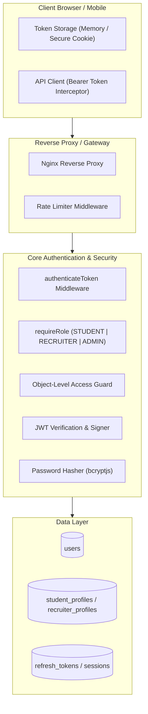

# Authentication & Authorization Architecture Diagram

```mermaid
graph TD
    subgraph Client ["Client Browser / Mobile"]
        Store["Token Storage (Memory / Secure Cookie)"]
        AxiosClient["API Client (Bearer Token Interceptor)"]
    end

    subgraph Gateway ["Reverse Proxy / Gateway"]
        Nginx["Nginx Reverse Proxy"]
        RateLimit["Rate Limiter Middleware"]
    end

    subgraph CoreAuth ["Core Authentication & Security"]
        AuthMiddleware["authenticateToken Middleware"]
        RBACMiddleware["requireRole (STUDENT | RECRUITER | ADMIN)"]
        OLACMiddleware["Object-Level Access Guard"]
        JWTService["JWT Verification & Signer"]
        BcryptService["Password Hasher (bcryptjs)"]
    end

    subgraph Data ["Data Layer"]
        UsersDB[("users")]
        ProfilesDB[("student_profiles / recruiter_profiles")]
        TokensDB[("refresh_tokens / sessions")]
    end

    Client --> Gateway
    Gateway --> CoreAuth
    CoreAuth --> Data
```
