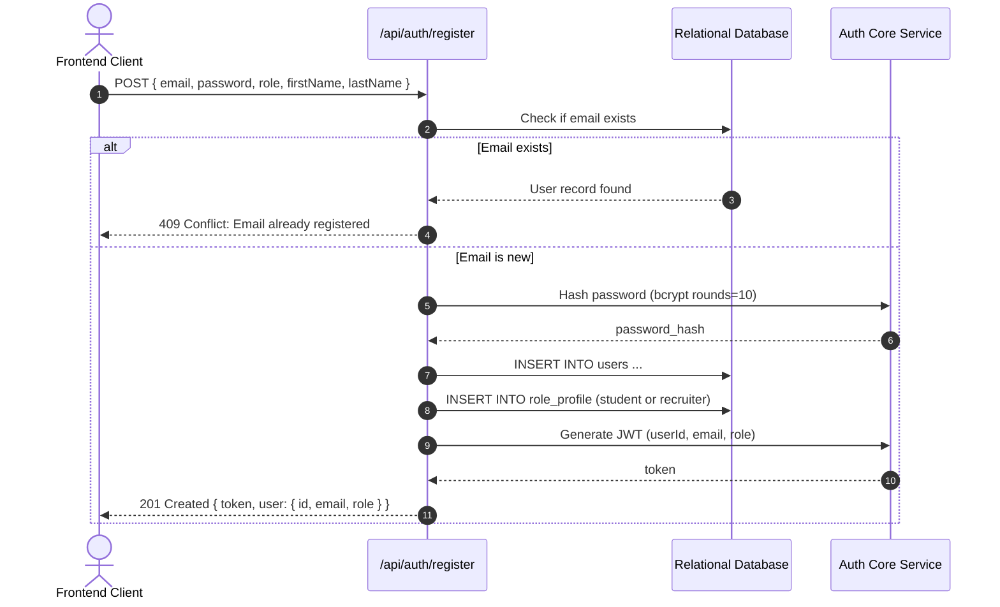
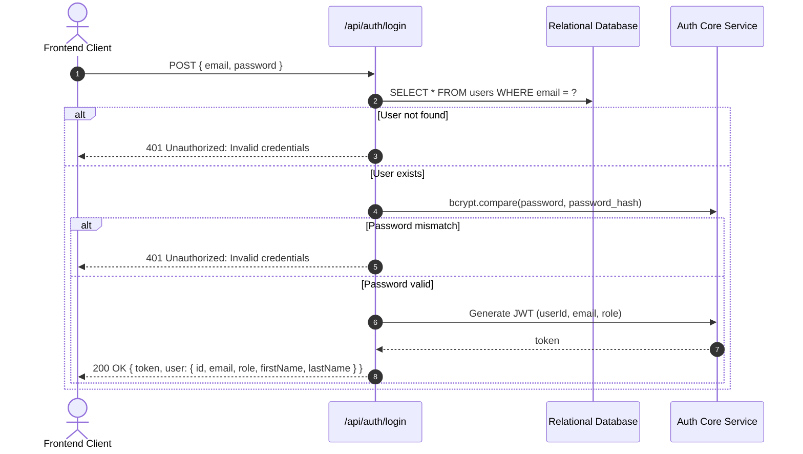

# Authentication Sequence Flows

### 1. User Registration Flow

```mermaid
sequenceDiagram
    autonumber
    actor Client as Frontend Client
    participant AuthAPI as /api/auth/register
    participant DB as Relational Database
    participant CoreAuth as Auth Core Service

    Client->>AuthAPI: POST { email, password, role, firstName, lastName }
    AuthAPI->>DB: Check if email exists
    alt Email exists
        DB-->>AuthAPI: User record found
        AuthAPI-->>Client: 409 Conflict: Email already registered
    else Email is new
        AuthAPI->>CoreAuth: Hash password (bcrypt rounds=10)
        CoreAuth-->>AuthAPI: password_hash
        AuthAPI->>DB: INSERT INTO users ...
        AuthAPI->>DB: INSERT INTO role_profile (student or recruiter)
        AuthAPI->>CoreAuth: Generate JWT (userId, email, role)
        CoreAuth-->>AuthAPI: token
        AuthAPI-->>Client: 201 Created { token, user: { id, email, role } }
    end
```

### 2. User Login Flow

```mermaid
sequenceDiagram
    autonumber
    actor Client as Frontend Client
    participant AuthAPI as /api/auth/login
    participant DB as Relational Database
    participant CoreAuth as Auth Core Service

    Client->>AuthAPI: POST { email, password }
    AuthAPI->>DB: SELECT * FROM users WHERE email = ?
    alt User not found
        AuthAPI-->>Client: 401 Unauthorized: Invalid credentials
    else User exists
        AuthAPI->>CoreAuth: bcrypt.compare(password, password_hash)
        alt Password mismatch
            AuthAPI-->>Client: 401 Unauthorized: Invalid credentials
        else Password valid
            AuthAPI->>CoreAuth: Generate JWT (userId, email, role)
            CoreAuth-->>AuthAPI: token
            AuthAPI-->>Client: 200 OK { token, user: { id, email, role, firstName, lastName } }
        end
    end
```
