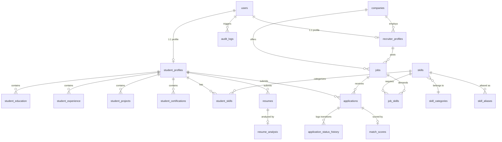

# Database Entity-Relationship Diagram (ERD)

## Entity Summary

* `users`: Universal identity table with roles (`student`, `recruiter`, `admin`).
* `companies`: Registered and verified hiring organizations.
* `student_profiles`: Enriched candidate data (bio, location, links, preferences).
* `recruiter_profiles`: Employer accounts linked to companies.
* `jobs`: Job listings with salary, location, requirements, and status.
* `job_skills`: Required vs. preferred technical competencies per job.
* `skills`, `skill_categories`, `skill_aliases`: Canonical ontology with parent-child relationships.
* `applications`: Application state tracking (`applied`, `under_review`, `shortlisted`, `interview`, `selected`, `rejected`).
* `match_scores`: Multi-criteria explainable evaluations.
