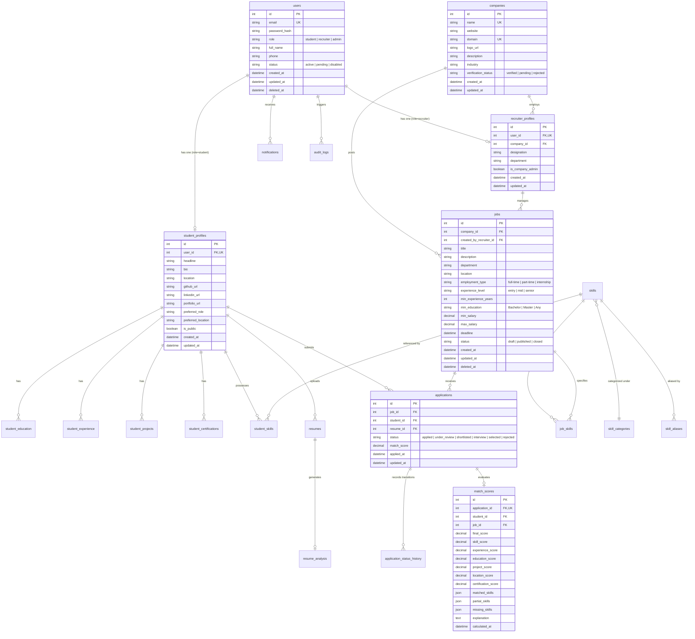

# Database Design: Unified Relational Data Architecture

**Lead Author**: Agent 4 (Database / Infrastructure Engineer)
**Contributors**: Agent 1 (Architect), Agent 2 (Backend), Agent 5 (Security)
**Status**: Proposal for Review
**Document Path**: `docs/architecture/database-design.md`

---

## 1. Database Architecture Overview

To eliminate data corruption, concurrency loss, and lack of relational integrity inherent in flat JSON files, the unified platform adopts **ONE normalized relational database**.

### Database Engine Strategy

* **Development & Testing**: SQLite 3 (via `better-sqlite3` or `sqlite3`) for zero-configuration, instant portability, self-contained local testing, and viva demonstration.
* **Production / Cloud Deployment**: PostgreSQL (compatible with Neon serverless Postgres or standard GCP Cloud SQL / Supabase) using an abstraction or Knex/Prisma query layer with standard SQL migrations.
* **ACID Guarantees**: Complete transactional safety for multi-step operations (e.g., submitting job applications, updating status history, saving parsed resumes).

---

## 2. Entity-Relationship Diagram (Mermaid)

---

## 3. Data Dictionary & Table Specifications

### 3.1 `users`

Central user identity table for all roles.

* **id**: `INTEGER PRIMARY KEY AUTOINCREMENT`
* **email**: `VARCHAR(255) NOT NULL UNIQUE` (indexed, lowercase)
* **password_hash**: `VARCHAR(255) NOT NULL` (bcrypt)
* **role**: `VARCHAR(20) NOT NULL` (`student`, `recruiter`, `admin`)
* **full_name**: `VARCHAR(255) NOT NULL`
* **phone**: `VARCHAR(30) NULL`
* **status**: `VARCHAR(20) NOT NULL DEFAULT 'active'` (`active`, `pending_approval`, `disabled`)
* **created_at**: `TIMESTAMP DEFAULT CURRENT_TIMESTAMP`
* **updated_at**: `TIMESTAMP DEFAULT CURRENT_TIMESTAMP`
* **deleted_at**: `TIMESTAMP NULL` (soft delete)
* **Access Rule**: Self, Admin.

### 3.2 `companies`

Registered and verified employer entities.

* **id**: `INTEGER PRIMARY KEY AUTOINCREMENT`
* **name**: `VARCHAR(255) NOT NULL UNIQUE`
* **website**: `VARCHAR(255) NULL`
* **domain**: `VARCHAR(255) NULL` (e.g. `google.com`)
* **logo_url**: `VARCHAR(512) NULL`
* **description**: `TEXT NULL`
* **industry**: `VARCHAR(100) NULL`
* **verification_status**: `VARCHAR(30) NOT NULL DEFAULT 'pending'` (`pending`, `verified`, `rejected`)
* **created_at**, **updated_at**: `TIMESTAMP DEFAULT CURRENT_TIMESTAMP`
* **Access Rule**: Public view when verified; Managed by Recruiter Admins and Platform Admin/TPO.

### 3.3 `recruiter_profiles`

Company recruiter details.

* **id**: `INTEGER PRIMARY KEY AUTOINCREMENT`
* **user_id**: `INTEGER NOT NULL UNIQUE REFERENCES users(id) ON DELETE CASCADE`
* **company_id**: `INTEGER NOT NULL REFERENCES companies(id) ON DELETE RESTRICT`
* **designation**: `VARCHAR(100) NULL`
* **department**: `VARCHAR(100) NULL`
* **is_company_admin**: `BOOLEAN DEFAULT 0`
* **created_at**, **updated_at**: `TIMESTAMP DEFAULT CURRENT_TIMESTAMP`

### 3.4 `student_profiles`

Expanded profile for enrolled students / candidates.

* **id**: `INTEGER PRIMARY KEY AUTOINCREMENT`
* **user_id**: `INTEGER NOT NULL UNIQUE REFERENCES users(id) ON DELETE CASCADE`
* **headline**: `VARCHAR(255) NULL`
* **bio**: `TEXT NULL`
* **location**: `VARCHAR(150) NULL`
* **github_url**: `VARCHAR(255) NULL`
* **linkedin_url**: `VARCHAR(255) NULL`
* **portfolio_url**: `VARCHAR(255) NULL`
* **preferred_role**: `VARCHAR(150) NULL`
* **preferred_location**: `VARCHAR(150) NULL`
* **is_public**: `BOOLEAN DEFAULT 1`
* **created_at**, **updated_at**: `TIMESTAMP DEFAULT CURRENT_TIMESTAMP`

### 3.5 Student Portfolio Sub-Entities

1. **`student_education`**: `id`, `student_id` (FK), `institution`, `degree`, `field_of_study`, `start_year`, `end_year`, `grade_or_cgpa`, `created_at`.
2. **`student_experience`**: `id`, `student_id` (FK), `company_name`, `role_title`, `location`, `start_date`, `end_date`, `is_current`, `description`, `created_at`.
3. **`student_projects`**: `id`, `student_id` (FK), `title`, `description`, `technologies` (JSON/TEXT), `project_url`, `github_url`, `created_at`.
4. **`student_certifications`**: `id`, `student_id` (FK), `title`, `issuing_organization`, `issue_date`, `expiration_date`, `credential_url`, `credential_id`.
5. **`student_skills`**: `id`, `student_id` (FK), `skill_id` (FK), `proficiency_level` (`beginner`, `intermediate`, `expert`), `source` (`manual`, `resume_extracted`, `quiz_verified`), `confidence_score`, `created_at`. Unique constraint on `(student_id, skill_id)`.

### 3.6 Skill Taxonomy Entities

1. **`skill_categories`**: `id`, `name` (UK, e.g., "Frontend", "Backend", "Data Science", "DevOps"), `description`.
2. **`skills`**: `id`, `category_id` (FK), `parent_skill_id` (FK nullable for hierarchy), `canonical_name` (UK, e.g., `JavaScript`, `React`, `Python`), `is_active` (`BOOLEAN DEFAULT 1`).
3. **`skill_aliases`**: `id`, `skill_id` (FK), `alias_name` (UK, e.g., `JS`, `ReactJS`, `Python3`, `ECMAScript`), `created_at`.

### 3.7 `jobs` & `job_skills`

* **`jobs`**:
  * `id`: `INTEGER PRIMARY KEY AUTOINCREMENT`
  * `company_id`: `INTEGER NOT NULL REFERENCES companies(id) ON DELETE CASCADE`
  * `created_by_recruiter_id`: `INTEGER NOT NULL REFERENCES recruiter_profiles(id)`
  * `title`: `VARCHAR(255) NOT NULL`
  * `description`: `TEXT NOT NULL`
  * `location`: `VARCHAR(150) NOT NULL`
  * `employment_type`: `VARCHAR(50) NOT NULL` (`full-time`, `part-time`, `internship`)
  * `min_experience_years`: `INTEGER DEFAULT 0`
  * `min_education`: `VARCHAR(100) DEFAULT 'Bachelor'`
  * `min_salary`: `DECIMAL(12,2) NULL`
  * `max_salary`: `DECIMAL(12,2) NULL`
  * `deadline`: `DATETIME NULL`
  * `status`: `VARCHAR(20) NOT NULL DEFAULT 'published'` (`draft`, `published`, `closed`)
  * `created_at`, `updated_at`, `deleted_at`
* **`job_skills`**:
  * `id`: `INTEGER PRIMARY KEY AUTOINCREMENT`
  * `job_id`: `INTEGER NOT NULL REFERENCES jobs(id) ON DELETE CASCADE`
  * `skill_id`: `INTEGER NOT NULL REFERENCES skills(id) ON DELETE RESTRICT`
  * `is_required`: `BOOLEAN NOT NULL DEFAULT 1` (`1` = Mandatory, `0` = Preferred)
  * `weight`: `DECIMAL(3,2) DEFAULT 1.0`
  * Unique constraint on `(job_id, skill_id)`

### 3.8 `applications` & `application_status_history`

* **`applications`**:
  * `id`: `INTEGER PRIMARY KEY AUTOINCREMENT`
  * `job_id`: `INTEGER NOT NULL REFERENCES jobs(id) ON DELETE CASCADE`
  * `student_id`: `INTEGER NOT NULL REFERENCES student_profiles(id) ON DELETE CASCADE`
  * `resume_id`: `INTEGER NOT NULL REFERENCES resumes(id)`
  * `status`: `VARCHAR(30) NOT NULL DEFAULT 'applied'` (`applied`, `under_review`, `shortlisted`, `interview`, `selected`, `rejected`)
  * `match_score`: `DECIMAL(5,2) NULL`
  * `applied_at`: `TIMESTAMP DEFAULT CURRENT_TIMESTAMP`
  * `updated_at`: `TIMESTAMP DEFAULT CURRENT_TIMESTAMP`
  * Unique constraint on `(job_id, student_id)` — A student can only apply once per job posting.
* **`application_status_history`**:
  * `id`: `INTEGER PRIMARY KEY AUTOINCREMENT`
  * `application_id`: `INTEGER NOT NULL REFERENCES applications(id) ON DELETE CASCADE`
  * `changed_by_user_id`: `INTEGER NOT NULL REFERENCES users(id)`
  * `previous_status`: `VARCHAR(30) NOT NULL`
  * `new_status`: `VARCHAR(30) NOT NULL`
  * `notes`: `TEXT NULL`
  * `created_at`: `TIMESTAMP DEFAULT CURRENT_TIMESTAMP`

### 3.9 `match_scores`

Cached match evaluations and explainable diagnostic breakdowns.

* `id`: `INTEGER PRIMARY KEY AUTOINCREMENT`
* `application_id`: `INTEGER NULL REFERENCES applications(id) ON DELETE CASCADE`
* `student_id`: `INTEGER NOT NULL REFERENCES student_profiles(id) ON DELETE CASCADE`
* `job_id`: `INTEGER NOT NULL REFERENCES jobs(id) ON DELETE CASCADE`
* `final_score`: `DECIMAL(5,2) NOT NULL`
* `skill_score`: `DECIMAL(5,2) NOT NULL`
* `experience_score`: `DECIMAL(5,2) NOT NULL`
* `education_score`: `DECIMAL(5,2) NOT NULL`
* `project_score`: `DECIMAL(5,2) NOT NULL`
* `location_score`: `DECIMAL(5,2) NOT NULL`
* `certification_score`: `DECIMAL(5,2) NOT NULL`
* `matched_skills`: `TEXT NOT NULL` (JSON array of canonical skill names)
* `partial_skills`: `TEXT NOT NULL` (JSON array of mapped relationships)
* `missing_skills`: `TEXT NOT NULL` (JSON array of missing required skills)
* `explanation`: `TEXT NOT NULL` (Structured human-readable diagnostic reasoning)
* `calculated_at`: `TIMESTAMP DEFAULT CURRENT_TIMESTAMP`
* Unique constraint on `(student_id, job_id)`

### 3.10 `resumes` & `resume_analysis`

* **`resumes`**: `id`, `student_id` (FK), `file_name`, `file_path`, `mime_type`, `file_size`, `raw_text`, `is_primary`, `created_at`.
* **`resume_analysis`**: `id`, `resume_id` (FK, UK), `ats_score`, `detected_skills` (JSON), `education_data` (JSON), `experience_data` (JSON), `extracted_data` (JSON), `analyzed_at`.

### 3.11 `notifications` & `audit_logs`

* **`notifications`**: `id`, `user_id` (FK), `title`, `message`, `type` (`application_status`, `job_alert`, `system`), `is_read`, `created_at`.
* **`audit_logs`**: `id`, `user_id` (FK nullable for failed logins), `action`, `resource_type`, `resource_id`, `ip_address`, `details` (JSON), `created_at`.

---

## 4. Migration Strategy: Flat GCS JSON to Relational Schema

To guarantee that zero existing users, candidates, questions, or resources are lost, we provide an automatic idempotent migration script:

1. Initialize SQLite / PostgreSQL tables with schema constraints.
2. Read existing `users.json`, hash verification, insert into `users` table.
3. Read `candidates.json`:
   * Map each candidate to a corresponding `users` record (if not exists, create user account).
   * Insert into `student_profiles`.
   * Parse candidate skills into `skills`, `skill_aliases`, and `student_skills`.
   * Store candidate resume assessment into `resumes` and `resume_analysis`.
4. Read `questionBank.json` and insert into normalized `quiz_questions` table.
5. Read `upgradeResources.json` and insert into `learning_resources` table.
6. Verify record counts match between JSON source and relational target.
