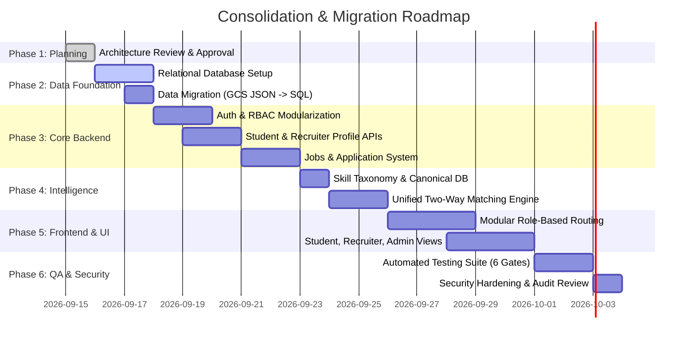

# Integration & Migration Plan: Unified Platform Consolidation

**Lead Author**: Agent 1 (Architect / Tech Lead)
**Contributors**: Agents 2, 3, 4, 5, 6
**Status**: Proposal for Review
**Document Path**: `docs/architecture/integration-plan.md`

---

## 1. Module Classification Matrix

Every existing component is systematically classified into one of five categories:

* **KEEP**: Preserved with minimal or no modifications.
* **MERGE**: Consolidated with other components to eliminate duplication.
* **REFACTOR**: Code restructured into modular architecture with clean contracts.
* **REPLACE**: Superseded by a superior, standard, or robust implementation.
* **DEPRECATE**: Removed entirely due to obsolescence, security risk, or technical debt.

 | Existing Module / File | Classification | Rationale & Actions | 
 | :--- | :---: | :--- | 
 | `api/services/resumeTailor.js` | **KEEP / REFACTOR** | Keep the robust deterministic ATS parsing, Google X-Y-Z formula analyzer, and DOCX/LaTeX generation. Refactor to query canonical skills from the database rather than hardcoded lists. | 
 | `api/services/interviewEvaluator.js` | **KEEP** | Multi-criteria scoring, communication grading, and Q&A parsing logic works well. Preserved and linked to job interview stages. | 
 | `talentai.js` (Multi-Router) | **KEEP** | Keep model fallback handling, OpenRouter gateway, token cost tracker (`costTracker.js`), and metrics (`modelStats.js`). | 
 | `api/middleware/security.js` | **KEEP** | Helmet, rate limiters, HPP, and input sanitizers are well-configured. Preserved as standard API gateway middleware. | 
 | Flat GCS JSON storage (`users.json`, `candidates.json`) | **REPLACE** | Replace with normalized Relational Database (SQLite in Dev / PostgreSQL in Prod) with transactional integrity. Existing data migrated via automated script. | 
 | `api/[...talentai].js` (Monolith) | **REFACTOR** | Decompose the 5,176-line monolith into dedicated domain modules: `api/modules/{auth, students, recruiters, companies, jobs, applications, skills, matching, admin}`. | 
 | `api/middleware/auth.js` | **MERGE** | Merge the conflicting inline `authenticateToken` in `[...talentai].js` into this single authoritative auth module. Eliminate dual-token confusion. | 
 | `api/services/jdMatching.js` | **REPLACE** | Replace prompt-based LLM candidate ranking with the deterministic, explainable two-way Hybrid Matching Engine. | 
 | `ml_service/` (FastAPI TF-IDF) | **DEPRECATE** | Deprecate unnecessary microservice. The TF-IDF cosine similarity is superseded by the explainable weighted matching engine inside the Node.js backend, reducing deployment complexity. | 
 | `frontend/src/App.js` (Monolith) | **REFACTOR** | Decompose the 7,220-line monolith into clean modular components and pages organized by role: `/student/*`, `/recruiter/*`, `/admin/*`. | 
 | Duplicate Legal Pages (`Privacy.js` vs `PrivacyPolicy.jsx`, `Terms.js` vs `Terms.jsx`) | **MERGE** | Retain single canonical `.jsx` files and delete redundant duplicates. | 
 | Hardcoded Credentials (`Anup@2610`) | **DEPRECATE** | Completely purge hardcoded superadmin passwords from source code and `.env.example`. | 

---

## 2. Source of Truth Definitions

 | Domain Entity | Single Source of Truth | 
 | :--- | :--- | 
 | **User Identity & Roles** | `users` table in Relational DB | 
 | **Student Profiles & Portfolios** | `student_profiles` and associated sub-tables (`education`, `experience`, `projects`, `certifications`, `student_skills`) | 
 | **Recruiter & Employer Identity** | `recruiter_profiles` and `companies` tables | 
 | **Job Postings & Requirements** | `jobs` and `job_skills` tables | 
 | **Application State & History** | `applications` and `application_status_history` tables | 
 | **Skills & Synonyms** | `skills`, `skill_categories`, and `skill_aliases` tables | 
 | **Match Scores & Explanations** | `match_scores` table (evaluated by Unified Matching Engine) | 
 | **Raw Resumes & Media Files** | Cloud Object Storage (GCS) or private local storage, indexed by `resumes` table | 

---

## 3. Migration Roadmap & Execution Phases

### Phase Details

#### Phase 1: Repository Audit & Architectural Approval (Current)

* Deliverables: Comprehensive audit, target architecture, DB schema, matching engine design, API design, security model, and integration roadmap.
* Gate: Architectural sign-off by project lead.

#### Phase 2: Relational Database & Data Migration

* Implement SQLite / PostgreSQL schema via database migration scripts.
* Implement automated ETL migration script reading legacy `users.json`, `candidates.json`, `questionBank.json` and populating normalized tables.
* Zero data loss validation.

#### Phase 3: Authentication & RBAC Modularization

* Extract `/api/auth` into `api/modules/auth/`.
* Unify token generation and verification with `JWT_ACCESS_SECRET` and `JWT_REFRESH_SECRET`.
* Eliminate hardcoded superadmin credentials; implement secure bootstrap script.
* Establish role middleware (`requireRole('student')`, `requireRole('recruiter')`, `requireRole('admin')`).

#### Phase 4: Student & Recruiter Profile Modules

* Implement `api/modules/students/` (CRUD for education, experience, projects, certifications, skills).
* Implement `api/modules/recruiters/` and `api/modules/companies/`.
* Integrate resume upload with student profile synchronization.

#### Phase 5: Skills Taxonomy & Normalization

* Seed comprehensive IT/Software skill taxonomy (500+ canonical skills, categories, aliases).
* Implement taxonomy lookup and alias resolver.

#### Phase 6: Jobs & Applications Lifecycle System

* Implement `api/modules/jobs/` (postings, required/preferred skills, status toggling).
* Implement `api/modules/applications/` (apply, status transitions, history tracking).
* Enforce recruiter ownership validation on all job and application endpoints.

#### Phase 7: Unified Two-Way Matching Engine

* Implement the explainable multi-criteria matching algorithm (`api/modules/matching/`).
* Connect to Student Job Recommendations (`GET /api/recommendations/jobs`).
* Connect to Recruiter Candidate Ranking (`GET /api/jobs/:id/matching-candidates`).
* Generate human-readable diagnostics and score breakdowns.

#### Phase 8: Frontend Modularization & Routing

* Restructure `frontend/src/`:
  * `src/routes/` with protected route guards for `/student/*`, `/recruiter/*`, `/admin/*`.
  * `src/pages/student/`: Dashboard, Profile, Resume, Skills, Jobs, Applications.
  * `src/pages/recruiter/`: Dashboard, Company, Jobs, PostJob, Candidates.
  * `src/pages/admin/`: Dashboard, Recruiters, Companies, Skills, AuditLogs.
  * `src/components/shared/`: Navbar, Stepper, Badges, Modals, Tables, Chatbot.
* Reuse existing Tailwind CSS tokens, theme switcher, and Lucide icons.

#### Phase 9: Security Hardening & IDOR Protection

* Implement `verifyCandidateAccess` middleware preventing cross-tenant candidate data leakage.
* Enforce 15-minute TTL on resume signed URLs.
* Implement prompt injection containment in AI services.
* Verify CORS and rate limits.

#### Phase 10: Testing Gates & Production Verification

* Run full automated test suite (Unit, Integration, Security, E2E).
* Execute the 15 deterministic matching test cases.
* Validate all 6 testing gates before declaring production readiness.
