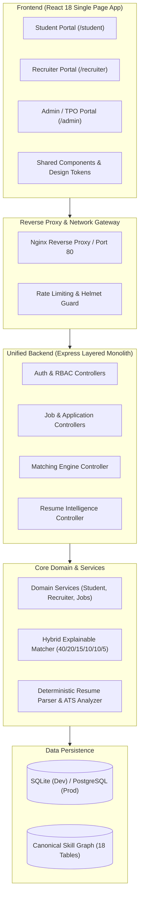

# System Architecture: Unified TalentAI Career Platform

**Platform**: Unified TalentAI Career & Recruitment Platform  
**Architecture Classification**: Modular Monorepo with Clean Layered Domains

---

## 1. High-Level Architectural Vision

TalentAI connects students, recruiters, and academic administrators into a single unified platform. Rather than running disconnected applications, the platform shares:
- **One Frontend**: A modern, responsive React 18 Single Page Application with role-based routing.
- **One Backend**: A layered Node.js / Express API service with an optional Python ML service.
- **One Relational Database**: SQLite for local zero-config development/demo and PostgreSQL for cloud production.
- **One Unified Auth System**: JWT-based authentication with decoupled Role-Based Access Control (RBAC).
- **One Two-Way Matching Engine**: Deterministic hybrid scoring algorithm serving both candidate ranking and job recommendations.

