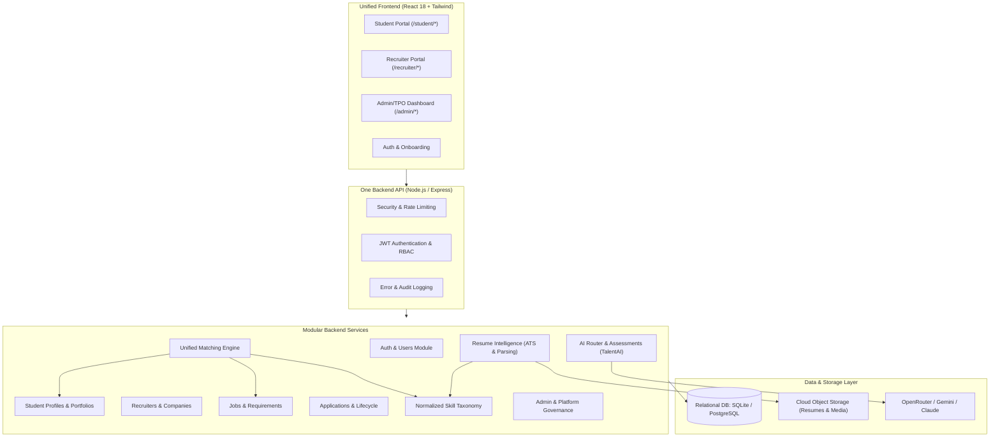
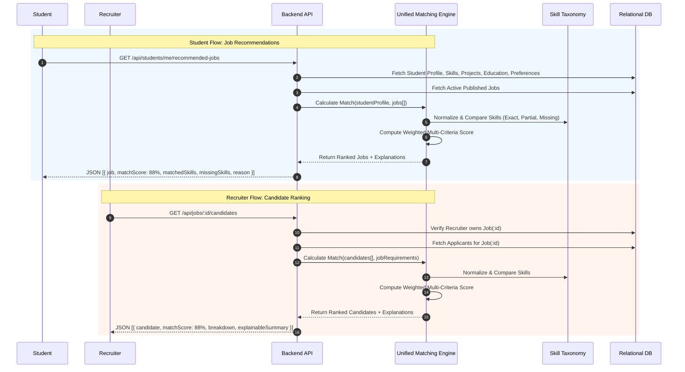

# Target Architecture: Unified Career & TalentAI Recruitment Platform

**Lead Author**: Agent 1 (Architect / Tech Lead)  
**Contributors**: Agent 2 (Backend), Agent 3 (Frontend), Agent 4 (Database), Agent 5 (Security), Agent 6 (QA)  
**Status**: Proposal for Review  
**Document Path**: `docs/architecture/target-architecture.md`

---

## 1. System Vision & High-Level Architecture

The unified platform consolidates the Student Career Platform and TalentAI into **ONE unified AI-powered career and recruitment platform**. TalentAI serves as the AI intelligence, resume analysis, and matching layer embedded directly within the career platform.

### Core Architectural Axioms
1. **ONE Frontend Application**: A single React application with role-aware routing (`/student/*`, `/recruiter/*`, `/admin/*`). Shared design tokens, forms, UI components, and API client.
2. **ONE Modular Backend Server**: A single Express REST API structured in domain modules (`auth/`, `users/`, `students/`, `recruiters/`, `companies/`, `jobs/`, `applications/`, `resumes/`, `skills/`, `matching/`, `admin/`).
3. **ONE Normalized Relational Database**: A clean SQL schema with foreign keys, indexes, and transactional guarantees, replacing the unstable GCS JSON storage.
4. **ONE Authentication & RBAC System**: Single JWT/Session auth with strict server-side role and object-level permission enforcement.
5. **ONE Shared Two-Way Matching Engine**: Deterministic, hybrid, explainable weighted matching algorithm that powers both Student Job Recommendations and Recruiter Candidate Rankings.



---

## 2. Component Decomposition & Boundaries

### 2.1 Backend Modules (`api/modules/`)

| Module | Responsibility | Inbound Dependencies | Outbound Dependencies |
| :--- | :--- | :--- | :--- |
| `auth/` | Registration, login, password hashing, JWT access/refresh token management, session revocation | Public / All | `users/`, `audit_logs` |
| `students/` | Student profiles, education, experience, projects, certifications, student skills | Student, Recruiter (authorized), Admin | `users/`, `skills/`, `resumes/` |
| `recruiters/` | Recruiter profile, verification state, company association | Recruiter, Admin | `users/`, `companies/` |
| `companies/` | Company profile, verification status, recruiter members | Recruiter, Admin, Public | `users/` |
| `jobs/` | Job creation, editing, publishing, skill requirements, filters, closing | Recruiter, Student, Admin | `companies/`, `skills/` |
| `applications/`| Job application lifecycle (`APPLIED` -> `UNDER_REVIEW` -> `SHORTLISTED` -> `INTERVIEW` -> `SELECTED` / `REJECTED`), status audit history | Student, Recruiter, Admin | `students/`, `jobs/`, `matching/` |
| `skills/` | Canonical skill directory, categories, aliases, hierarchy, normalization | All modules | Database |
| `matching/` | Two-way hybrid weighted matching engine (Student <-> Job), score explanations, gap analysis | Student (`recommended-jobs`), Recruiter (`candidate-ranking`), Applications | `skills/`, `students/`, `jobs/` |
| `resumes/` | Document upload, deterministic parsing, ATS scoring, Docx/LaTeX generation | Student, Recruiter (authorized) | Storage (GCS/Local), `skills/` |
| `ai/` | Multi-model routing (OpenRouter/Gemini/Claude), interview evaluator, quiz generation, bias detection | Student, Recruiter, Admin | External AI APIs |
| `admin/` | Recruiter approvals, company management, platform statistics, audit logs, skill taxonomy maintenance | Admin/TPO | All modules |

---

## 3. Two-Way Matching Flow



---

## 4. Frontend Architecture & Role-Based Routing

The frontend shifts from single-file state toggles in `App.js` to declarative, protected routes via `react-router-dom`:

```text
/                                    -> Landing Page (Home.js, marketing, feature overview)
/login                              -> Shared Authentication Screen
/register                           -> Role Selection & Registration (Student or Recruiter)

/student/
  ├── dashboard                     -> Overview: profile status, quick stats, active applications
  ├── profile                       -> Comprehensive Profile Editor (Education, Experience, Projects, Certs)
  ├── resume                        -> Resume Upload, ATS Diagnostic, Tailor & Formatter (Docx/LaTeX)
  ├── skills                        -> Extracted Skills, Verified Skills, Skill Gap Explorer
  ├── jobs                          -> Searchable Job Directory with Match Badges
  ├── jobs/:id                      -> Job Details, Match Score Breakdown, One-Click Apply
  └── applications                  -> Application Tracker with Timeline & Status History

/recruiter/
  ├── dashboard                     -> Recruiter KPIs, active jobs, recent applications
  ├── company                       -> Company Profile & Branding Management
  ├── jobs                          -> Job List (Published, Draft, Closed)
  ├── jobs/create                   -> Job Posting Wizard (Required/Preferred Skills, Experience, Education)
  ├── jobs/:id                      -> Job Overview & Pipeline Stats
  ├── jobs/:id/candidates           -> AI-Ranked Candidate Funnel (Shortlist, Reject, Move Stage)
  └── candidates/:id                -> Detailed Candidate View (Protected: Applicants Only)

/admin/
  ├── dashboard                     -> TPO & Campus Analytics, Placement Rates, Verification Queue
  ├── recruiters                    -> Recruiter Verification & Account Management
  ├── companies                     -> Company Directory & Drive Approvals
  ├── jobs                          -> Platform-wide Job Moderation
  ├── skills                        -> Skill Taxonomy Manager (Canonical Names, Aliases, Categories)
  └── audit-logs                    -> System Security & Authorization Logs
```

---

## 5. Architectural Quality Attributes

1. **Explainability**: Every match score includes a deterministic, human-readable breakdown. No opaque "black-box" rejections.
2. **Determinism & Performance**: Multi-criteria matching is calculated in sub-50ms deterministic Node.js algorithms; LLMs are reserved for natural language analysis and interview coaching, not critical sorting or mathematical ranking.
3. **Data Protection & Least Privilege**: Student contact data and resumes are isolated behind verified application links.
4. **Maintainability**: Clear single responsibility per module; independent testability for each workstream.
