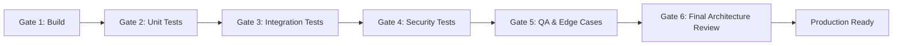

# Testing Strategy: Quality Assurance & Verification Protocol

**Lead Author**: Agent 6 (QA / Testing Engineer)
**Contributors**: Agents 1, 2, 5
**Status**: Proposal for Review
**Document Path**: `docs/architecture/testing-strategy.md`

---

## 1. Quality Assurance Protocol & Operating Philosophy

As Agent 6 (QA Engineer), I enforce **evidence-based completion**:

* No feature is declared complete based on developer claims alone.
* Every claim must have verifiable proof: automated test suite outputs, command exit codes, and integration verification logs.
* Testing encompasses happy paths, boundary conditions, malicious payloads, and edge cases.

---

## 2. Six Mandatory Testing Gates

### Gate 1: Build & Static Analysis

* Node.js backend starts clean without runtime warnings or unhandled rejections.
* Frontend React bundle builds cleanly (`npm run build` exits with code 0).
* Zero critical ESLint or compiler syntax errors.

### Gate 2: Unit & Algorithmic Tests

* Skill normalization & alias resolution.
* Deterministic hybrid match score calculations.
* Weight configuration variance checks.
* Education & experience hierarchy parsers.

### Gate 3: API & Lifecycle Integration Tests

* End-to-end user registration and JWT token issue.
* Student profile population (education, experience, projects, skills).
* Recruiter company association and job creation.
* Student job application submission and status tracking.
* Recruiter status transition updates and status history audit logging.

### Gate 4: Security & Penetration Testing

* **Role Escalation**: Student attempts to call `/api/admin/*` or `/api/jobs` (POST) $\rightarrow$ Expected `403 FORBIDDEN`.
* **IDOR / BOLA**: Recruiter A attempts to view applicants for Recruiter B's jobs or arbitrary student profiles $\rightarrow$ Expected `403 FORBIDDEN`.
* **SQL Injection**: Inputting `' OR 1=1 --` into login or search fields $\rightarrow$ Sanitized, parameterized execution.
* **XSS Payloads**: Inputting `` into profile or bio fields $\rightarrow$ Sanitized and escaped.
* **Path Traversal & Malicious File Upload**: Uploading `.php`, `.exe`, or `../../etc/passwd` $\rightarrow$ Rejected by MIME and magic bytes inspection.
* **JWT Manipulation**: Forged tokens or expired tokens $\rightarrow$ Rejected with `401/403`.

### Gate 5: QA User Flows & Edge Cases

* All 15 deterministic matching test cases verified.
* Concurrency test: Multiple simultaneous applications do not trigger race conditions or duplicate records.
* Soft deletion validation: Deleting a job does not corrupt historic application records.

### Gate 6: Final Review & Production Readiness

* Complete documentation review.
* Explainability check for viva demonstration: Verify that all algorithms and data structures can be articulated simply and clearly.

---

## 3. Detailed Automated Test Suites

### 3.1 Unit Test Suite (`tests/unit/`)

1. **`matchingEngine.test.js`**:
   * Computes weighted score across 15 standard candidate/job profiles.
   * Verifies mathematical precision (e.g. 81.5% $\pm 0.1\%$).
   * Validates configurable weight changes reflect accurately.
2. **`skillTaxonomy.test.js`**:
   * Tests alias mapping (`JS`, `Javascript` $\rightarrow$ `JavaScript`).
   * Tests hierarchy detection (`React` $\rightarrow$ child of `JavaScript`).
   * Tests partial vs exact vs missing classifications.
3. **`resumeParser.test.js`**:
   * Validates deterministic parsing of sample resumes (PDF and DOCX).
   * Validates rejection of non-resume files (invoices, code files).

### 3.2 Integration Test Suite (`tests/integration/`)

1. **`authFlow.test.js`**:
   * Registers student and recruiter.
   * Verifies bcrypt password hashing.
   * Tests access token expiry and refresh token rotation.
2. **`jobApplicationLifecycle.test.js`**:
   * Recruiter posts job with required skills (`Python`, `FastAPI`).
   * Student uploads resume and applies for job.
   * Verifies application record created with initial status `applied`.
   * Recruiter updates status to `shortlisted` with feedback note.
   * Verifies `application_status_history` records previous status, new status, timestamp, and user ID.
   * Verifies student sees updated status.
3. **`twoWayMatching.test.js`**:
   * Queries `GET /api/recommendations/jobs` as student $\rightarrow$ asserts ranked jobs list with match breakdown.
   * Queries `GET /api/jobs/:id/matching-candidates` as recruiter $\rightarrow$ asserts ranked candidates list with match breakdown.

### 3.3 Security Test Suite (`tests/security/`)

1. **`rbacEnforcement.test.js`**:
   * Matrix test running all API routes against anonymous, student, recruiter, and admin tokens.
2. **`idorProtection.test.js`**:
   * Asserts that a recruiter cannot download a resume for a student who has not applied to their company.
3. **`promptInjection.test.js`**:
   * Sends resumes containing prompt injection strings; verifies that the matching score is computed deterministically and not coerced to 100%.

---

## 4. End-to-End Deterministic Matching Test Matrix

 | Test ID | Scenario | Input Vector | Expected Verification | 
 | :--- | :--- | :--- | :--- | 
 | **MATCH-01** | Exact Match | Candidate skills match all job required skills; experience $\ge$ min; education $\ge$ min | Final Score $\ge 95\%$, `missing_skills` is empty | 
 | **MATCH-02** | Complete Mismatch | Disjoint skills; experience = 0; unrelated degree | Skill Score = 0; Final Score reflects baseline only | 
 | **MATCH-03** | Partial Skill Match | Job requires `PostgreSQL`; Candidate has `SQL` | `SQL` mapped to `partial_skills` with 0.6 factor | 
 | **MATCH-04** | Derived Framework Match | Job requires `JavaScript`; Candidate has `React` | `React` mapped as derived match with 0.8 factor | 
 | **MATCH-05** | Missing Required Skill | Candidate matches 4/5 skills, missing `AWS` | `AWS` listed in `missing_skills`; penalty applied | 
 | **MATCH-06** | Under-Experience | Job requires 3 years; Candidate has 1.5 years | Experience score graduated at $50\% \times 0.85 = 42.5\%$ | 
 | **MATCH-07** | Over-Experience | Job requires 1 year; Candidate has 4 years | Experience score capped at $100\%$ | 
 | **MATCH-08** | Education Gap | Job requires `Master`; Candidate has `Bachelor` | Education score awarded partial credit (65%) | 
 | **MATCH-09** | Remote Alignment | Job is Remote; Candidate in any location | Location score = 100% | 
 | **MATCH-10** | Location Mismatch | Job in Mumbai (on-site); Candidate in Kolkata | Location score = 40% | 
 | **MATCH-11** | Empty Profile | Student has registered but filled no details | Handled gracefully; Score = 0%; no crashes | 
 | **MATCH-12** | Duplicate Skills | Candidate lists `Python` multiple times | Deduplicated; scored once | 
 | **MATCH-13** | Alias Resolution | Candidate has `NodeJS`, Job requires `Node.js` | Recognized as identical canonical skill | 
 | **MATCH-14** | Closed Job | Job has `status = 'closed'` | Excluded from recommendations | 
 | **MATCH-15** | Expired Job | Job has past `deadline` | Excluded from recommendations | 
