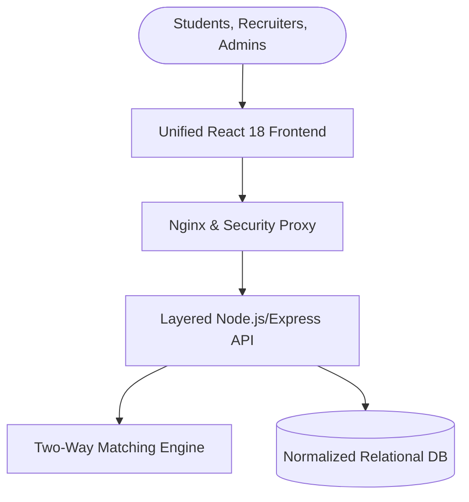
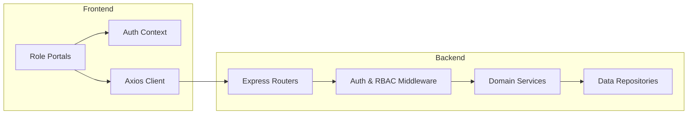
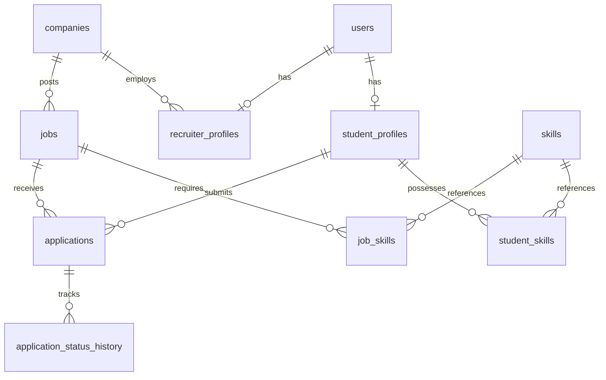
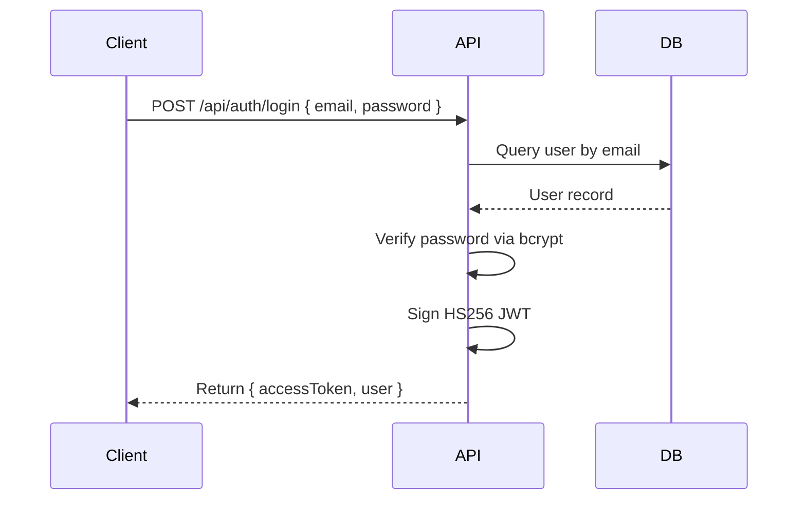
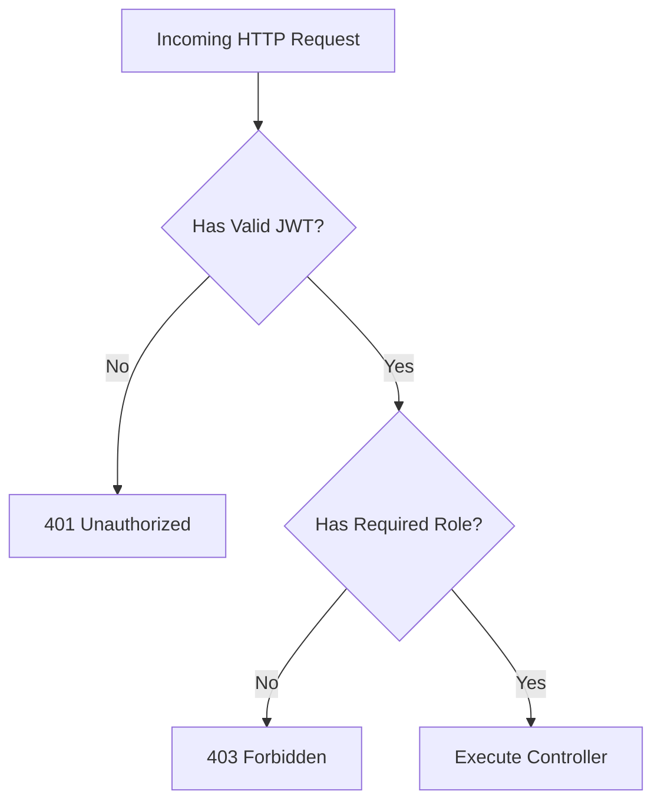
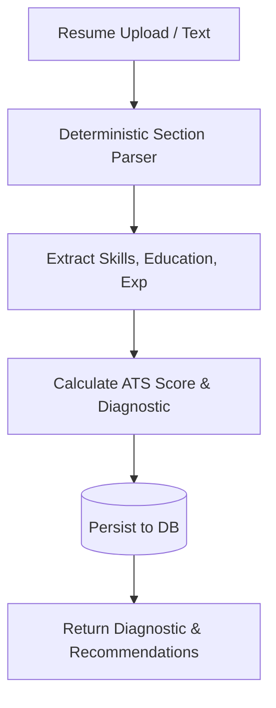
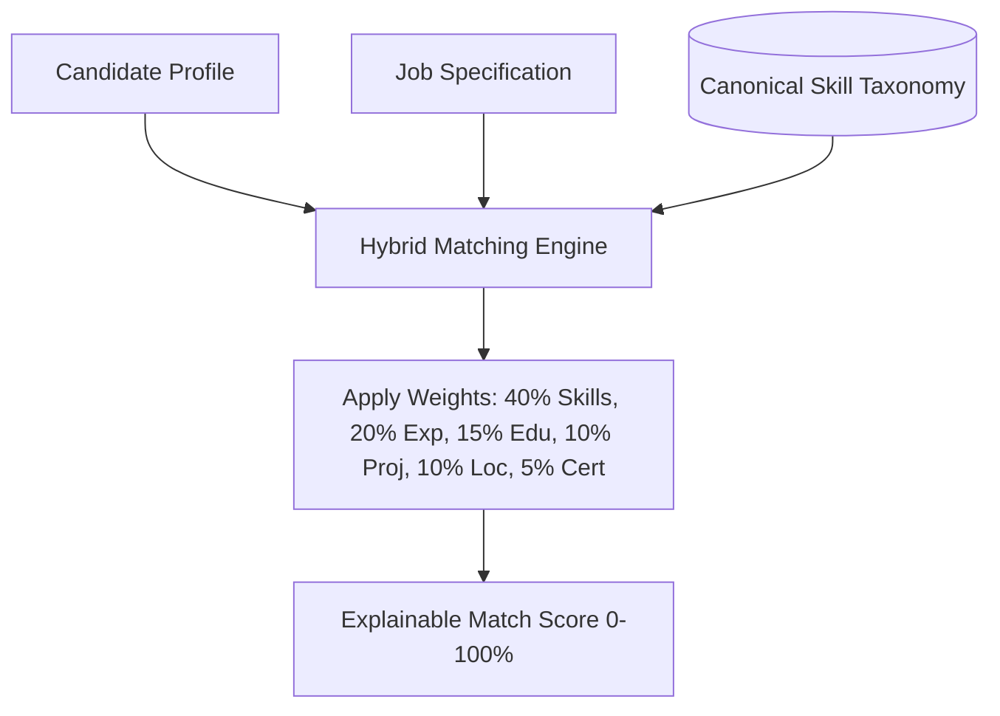
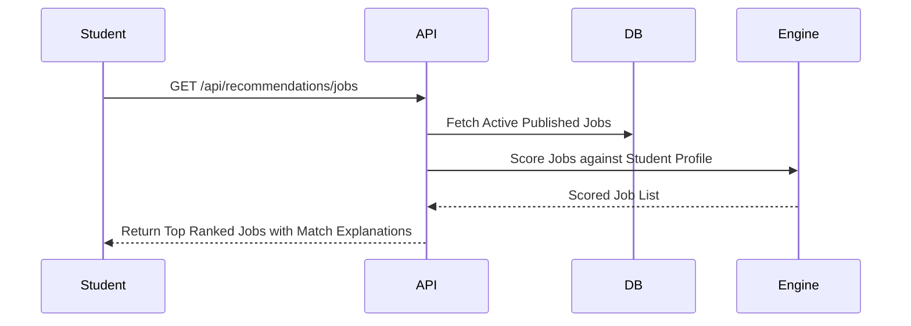
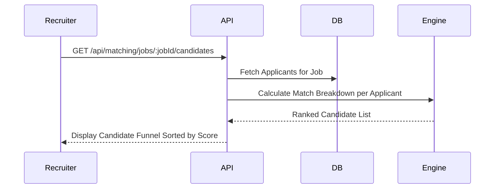
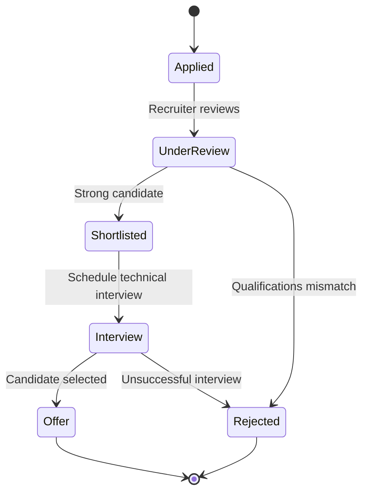

# Master Architectural Diagrams (10 Mermaid Diagrams)

---

## 1. Overall System Architecture

---

## 2. Frontend / Backend Architecture

---

## 3. Database Entity-Relationship Diagram (ERD)

---

## 4. Authentication Flow

---

## 5. Authorization & RBAC

---

## 6. Resume Processing Lifecycle

---

## 7. Two-Way Hybrid Matching Engine

---

## 8. Student Job Recommendation Flow

---

## 9. Recruiter Candidate Ranking Flow

---

## 10. Application Lifecycle State Machine

